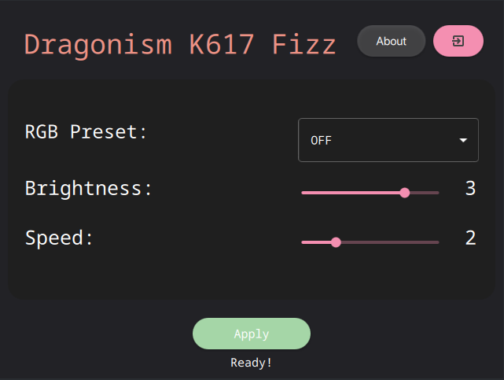

# Dragonism K617 (A support software for Redragon k617 fizz on Linux)



An applicaton to change RGB settings on the keyboard using an User Interface.

I made this application just for my convinience to switch brightness, modes, and speed of effects. I have much more to add like a color picker, a color changer, ability to add custom lighting and much more. I would do them in future releases. Just consider this as a beta build!

## Requirements
This primarily works on the Arch Linux and the forks that use the latest packages (Unlike Manjaro and some others). This has been tested and developed on the Arch Linux. **No other distro is supported till now**. 

### Dependencies

```
sudo pacman -S bash xorg-xhost libglvnd
```

If you are on Hyprland, please install ```xorg-xhost``` and run this command:

```
xhost +local:root
```

## Downloads
[Link!](https://github.com/JQx-999/Dragonism-K617-Fizz-Unofficial-/releases/download/v0.1/Dragonism_K617-x86_64.AppImage)

[Releases](https://github.com/JQx-999/Dragonism-K617-Fizz-Unofficial-/releases)

You are required to run this Appimage with admin/sudo privileges.

For example:-
```
sudo ./Elan_0c00_support-x86_64.AppImage
```
